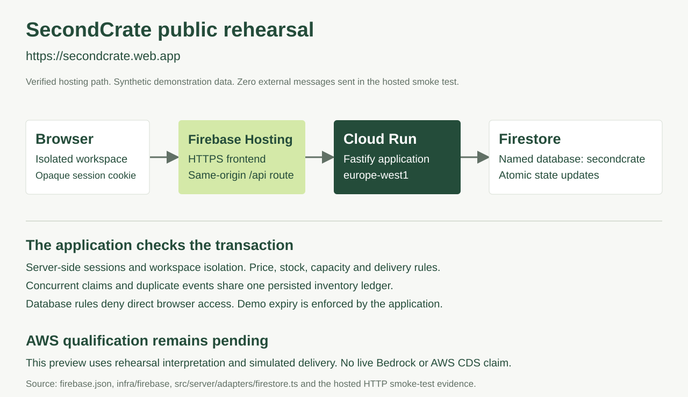
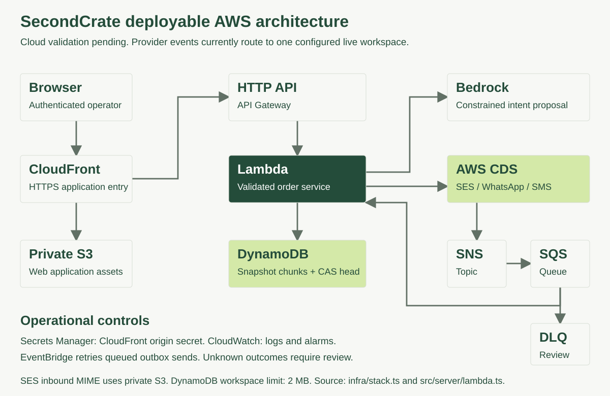

<div align="center">
  
  <h1>SecondCrate</h1>
  <p><strong>Every good lot deserves a buyer.</strong></p>
  <p>Turn cancelled wholesale food orders into confirmed commitments - through the conversations buyers already use.</p>
  <p>Built by <strong>Shivam Gupta</strong> · AWS CDS Agentic AI Partner Hackathon 2026</p>
</div>

## The moment we solve

A restaurant cancels forty crates of cherry tomatoes. The stock is good, the truck leaves soon, and the wholesaler knows several kitchens that could use it. Today that recovery can become a rushed phone tree: repeated explanations, uncertain quantities and competing promises.

SecondCrate gives that lot a second destination. The operator releases the stock and sets the commercial boundaries. The agent matches existing opted-in buyers, interprets their replies across WhatsApp, SMS and email, and checks each proposed commitment against actual inventory, price authority and delivery constraints. Confirmations and an audit trail complete the workflow.

**The defining demo:** two buyers ask for the last eight crates at the same time. Both can negotiate; only one can receive the stock. This is an actual concurrent transaction test, not an animation.

**Try the hosted rehearsal:** [secondcrate.web.app](https://secondcrate.web.app). Choose **Explore the interactive demo** for an isolated workspace with fictional buyers and simulated messaging.

**Watch the product:** [2:46 narrated demonstration with captions](https://secondcrate.web.app/demo.html). It uses actual application captures, edited for clarity, and disclosed OpenAI cedar narration.

**Watch the narrated walkthrough:** [2:46 captioned demo](https://secondcrate.web.app/demo.html), using actual hosted application captures. [Download the MP4](deliverables/SecondCrate-Demo.mp4).

**Current verification:** 127 automated tests and the production build pass. The Firebase-hosted release passed the complete HTTP recovery workflow plus session, tenant-isolation and persistence checks. Its API runs on Cloud Run with a dedicated Firestore database. AWS deployment and live Bedrock/CDS verification remain blocked under the current AWS Free plan; no paid-plan upgrade was authorised. See the [hosted deployment evidence](docs/evidence/firebase-deployment.json) and [final review](docs/FINAL_REVIEW.md).

Private account creation and password login also work in the hosted preview. Email verification and forgotten-password recovery require SES configuration and are currently unavailable. Use the isolated demo for the complete judge walkthrough.

## Run in two minutes

Requires **Node.js 22+** and npm. No API keys, phone number or paid subscription are needed for local rehearsal.

```bash
git clone https://github.com/shi1720/AWS-Communication-Developer.git
cd AWS-Communication-Developer
npm ci
npm run dev
```

Open **http://127.0.0.1:5279** and choose **Explore the interactive demo**. The API runs on port 3279. Each demo login creates an isolated workspace with synthetic contacts; messages are simulated. Optional local account registration creates an empty private workspace. Passwords must have 12–128 characters, a letter and a number.

For a compiled local server:

```bash
npm run build
npm start
```

Open **http://127.0.0.1:3279**. Local state persists in the ignored `.data/` directory and supports one server process. The hosted preview uses Firestore; the intended AWS deployment uses DynamoDB.

## Try the complete recovery

1. Launch the seeded cherry-tomato recovery from **Overview**.
2. Open **Conversations**, select **Olive & Rye**, and send `I can take 12 crates at £17 each.` through the buyer rehearsal panel. Twelve crates are committed for £204.
3. Select **The Sunday Table** and send `I'll take 20 crates at £18 each.` Twenty more crates are committed for £360.
4. Click **Test stock lock** when eight crates remain. Two distinct buyers submit requests concurrently. One receives eight crates for £144; the other cannot over-allocate.
5. Inspect the three orders, zero remaining crates, **£708 recovered order value**, and the actual tool/audit records. Switch a buyer's rehearsal channel to show that the same conversation and capacity persist.
6. Try an offer below the price floor, a request beyond buyer capacity, or `STOP`. Inspect the resulting safeguards and consent suppression.

The £708 is sales value, not profit. With the synthetic £480 book cost, the gross product spread is £228 before handling, delivery, messaging and overhead. The demo's 200 kg allocated is not a verified waste-avoidance claim. Reset your own sandbox in **Settings** for another run.

## What is implemented

- Operator login, registration, email verification, password reset and revocable sessions.
- Stock intake with cancellation-text extraction, mandatory operator release attestation, price boundaries and dispatch/delivery windows.
- Buyer profiles, category and route matching, capacity limits, channel preferences and dated consent records. Re-enabling outreach requires recorded consent.
- Structured Amazon Bedrock intent extraction, followed by deterministic validation and atomic order/inventory updates. A transparent local rehearsal engine runs without credentials.
- Direct AWS SDK adapters for **Amazon SES**, **AWS End User Messaging SMS** and **AWS End User Messaging Social (WhatsApp)**.
- Trusted provider inbound routing via SNS → SQS → Lambda; SES MIME intake and delivery receipts; ambiguous messages retained for review.
- Persistent outbox, duplicate-event handling, conditional concurrency, delivery-state tracking and operator reconciliation of uncertain sends. Unknown sends are never blindly retried.
- Order dispatch records, CSV export, complete JSON workspace archive with checksum, audit log and an editable commercial-value model.
- Responsive interface, self-hosted fonts, keyboard-accessible dialogs, visible environment/channel status and original vector artwork.

## Hosted preview and intended AWS architecture



Firebase Hosting serves the public rehearsal and routes `/api` requests to Cloud Run. The server authenticates the session and commits inventory through Firestore transactions. Browser clients cannot access the database directly. Rehearsal reasoning and delivery remain explicit in the interface. See [preview deployment instructions and limits](infra/firebase/README.md).



The separate AWS CDK design above remains undeployed. It defines CloudFront with private S3 assets, same-origin API requests through API Gateway and Lambda, and DynamoDB persistence. Bedrock proposes typed intent; application rules authorise stock allocation. AWS CDS adapters send communications, with provider events routed through SNS/SQS. EventBridge recovers queued outbox work; CloudWatch and a dead-letter queue expose failures.

The stack uses origin verification, private buckets, narrowly scoped send permissions, encrypted storage, DynamoDB point-in-time recovery, security headers and API throttling. No NAT gateway or always-on database is required.

**Deploy:** follow [AWS deployment and channel setup](docs/AWS_DEPLOYMENT.md). The stack does not provision paid phone numbers or bypass Meta template approval. An AWS-hosted rehearsal is not evidence of live CDS use. Deployment and live-service verification must succeed before submitting those claims.

## Validation

```bash
npm run check         # TypeScript, tests, production build
npm run infra:synth   # Generate and validate CloudFormation
npm run smoke         # HTTP end-to-end test against running development app
```

For the compiled server, run `SECONDCRATE_URL=http://127.0.0.1:3279 npm run smoke`.

The tests cover competing allocations, duplicate inbound events, stale negotiations, price/capacity/consent guards, tenant isolation, session revocation, reset-token races, origin checks, provider payloads, monotonic receipts, unknown sends, DynamoDB snapshot integrity and infrastructure controls. The HTTP smoke test exercises the real server and persistence through the same-origin web proxy, verifies £708/40 crates/three orders, and revokes its session. Evidence is written to `docs/evidence/http-smoke.json` without credentials.

See the [hosted recovery evidence](docs/evidence/firebase-http-smoke.json), [hosted security evidence](docs/evidence/firebase-security-smoke.json) and [final independent review](docs/FINAL_REVIEW.md). The [earlier implementation review](docs/REVIEW.md) records the initial findings and fixes.

## Commercial case

The initial customer is a regional produce wholesaler with an existing restaurant network and a time-sensitive cancelled-order problem. SecondCrate fits around those relationships. It is not an open surplus marketplace and does not require buyers to install another app.

The working pricing hypothesis is **£299 per depot per month** for a defined recovery allowance, subject to customer discovery and usage economics. The intended advantage is recovery-specific integration, policy enforcement and an increasingly useful record of buyers' responses - not a proprietary claim over commodity language models. See [business model and sensitivity analysis](docs/BUSINESS_CASE.md) and [primary-source research and competitors](docs/RESEARCH.md). No customer traction or validated willingness to pay is claimed.

## Submission and recording kit

| Deliverable                             | File                                                                                                                                 |
| --------------------------------------- | ------------------------------------------------------------------------------------------------------------------------------------ |
| Paste-ready Devpost description         | [Submission](docs/SUBMISSION.md)                                                                                                     |
| Devpost fields and testing instructions | [Field pack](docs/DEVPOST_FIELDS.md)                                                                                                 |
| Public preview architecture             | [Firebase/Cloud Run/Firestore SVG](docs/assets/preview-architecture.svg)                                                             |
| Intended AWS architecture               | [AWS SVG](docs/assets/architecture.svg)                                                                                              |
| Editable presentation                   | [PowerPoint](deliverables/SecondCrate-Pitch.pptx)                                                                                    |
| Presentation PDF                        | [Pitch](deliverables/SecondCrate-Pitch.pdf)                                                                                          |
| Product and technical brief             | [Two-page brief](deliverables/SecondCrate-Product-Technical-Brief.pdf)                                                               |
| Verbatim three-minute narration         | [Script](docs/VIDEO_SCRIPT.md)                                                                                                       |
| Offline recording teleprompter          | [Teleprompter](deliverables/SecondCrate-Teleprompter.html)                                                                           |
| Recording instructions                  | [Mac recording guide](docs/RECORDING_GUIDE.md)                                                                                       |
| Captioned product walkthrough           | [MP4 video](deliverables/SecondCrate-Demo.mp4) · [SRT](deliverables/SecondCrate-Demo.srt) · [VTT](deliverables/SecondCrate-Demo.vtt) |
| YouTube title and description           | [Publishing copy](docs/YOUTUBE.md)                                                                                                   |
| Rubric and eligibility checklist        | [Requirements](docs/REQUIREMENTS.md)                                                                                                 |
| Accurate Partner Central preparation    | [ACE opportunity draft](docs/ACE_OPPORTUNITY_DRAFT.md)                                                                               |

The final submission still requires verified AWS runtime evidence, the published final demonstration video, accurate APN/corporate-email eligibility and a real ACE opportunity ID. The checklist records these explicitly; placeholder IDs and simulated deliveries must never be submitted as real evidence.

## Scope and operating limits

This release is a bounded single-depot pilot with one routed live workspace per deployment. It permits at most 100 buyers and 100 lots, stops ordinary domain writes at 1.5 MB and reserves storage headroom for receipts and opt-outs within a 2 MB workspace cap. It does not silently erase history. Export and arrange a reviewed migration before reaching capacity; partitioned entity storage is required for long-running high-volume rollout.

SecondCrate records commitments and dispatch actions. It does not collect payment, issue tax invoices, connect an ERP, optimize routes, judge food condition or certify carbon savings. A customer rollout needs its own fulfilment integration, retention/consent policy and external security review. See [API and operational boundaries](docs/API_AND_SECURITY.md).

## Project structure

```text
src/client/           React application, forms and concurrency demonstration
src/server/           API, authentication, policy tools, local runtime
src/server/adapters/  AWS messaging, Bedrock, provider events, DynamoDB
src/shared/           Typed application contracts
infra/                AWS CDK stack
scripts/              End-to-end checks and artifact generation
tests/               Domain, API, adapter and infrastructure tests
docs/                Evidence, deployment, business case and submission
deliverables/        Presentation, PDFs and recording kit
```

## Authorship and license

Created and owned by **Shivam Gupta**, developed with AI-assisted engineering, research and design. Product decisions, configuration, review and final submission remain the creator's responsibility. Demo businesses and people are fictional. Original application code and artwork are licensed under [MIT](LICENSE). Third-party packages and fonts retain their own licenses; see [third-party notices](THIRD_PARTY_NOTICES.md).

Judge walkthrough: [Testing instructions](docs/TESTING_INSTRUCTIONS.md).
